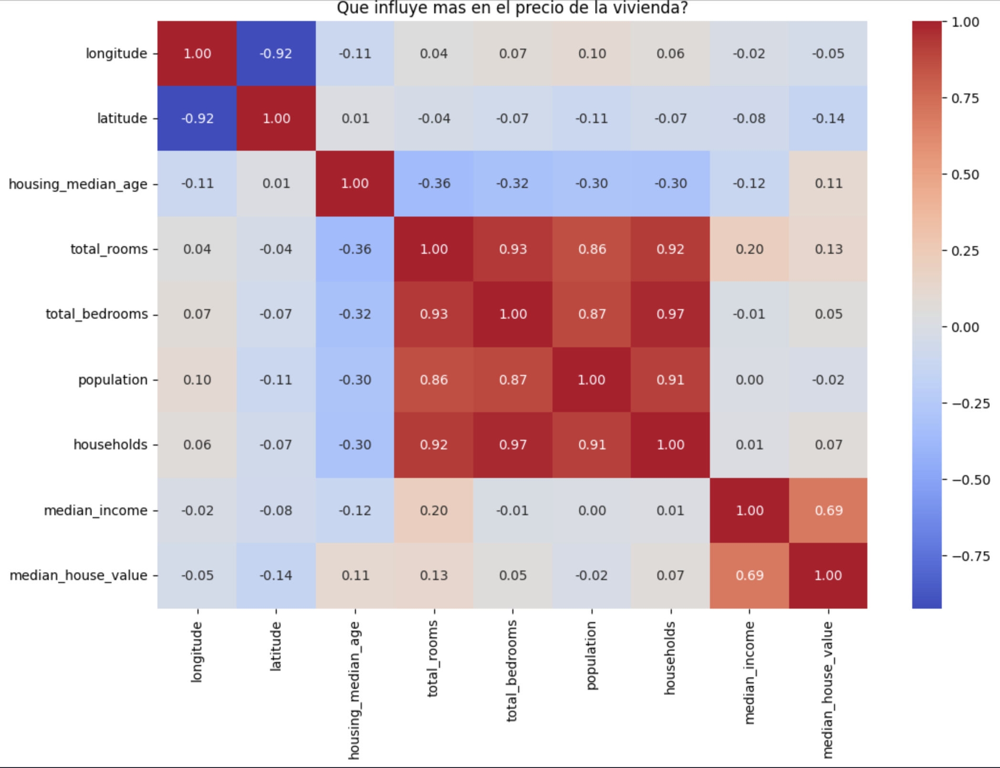

# Madrid Housing price prediction
The dataset I used is from housing price of California

Hi! This is my first proyect o data Science and Artificial Intelligence. I´m studying Computer Science. The objective of this proyect is predict the price of housing

## Objective of the proyect

the end of this model is analyze variables such as location, number of bedrooms, numer of beds or the income level of the area using a sataset of California

## Steps taken

* **Explorating analyze:** Visualization of distributions and heat maps
* **data cleaning:** null value management in the column of bedrooms
* **Model:** Use of the Linear Regression to training

## Technologies used
* **python** 3.14.3
* **pandas** data management
* **Matplotlib & Seaborn** Graphics
* **Scikit-Learn** Linear Regression, Machine Learning

## Conclusion

So far, **we have discovered that the median income (median_income) is the factor that most influences in the housing price**

**Warm graphic**

